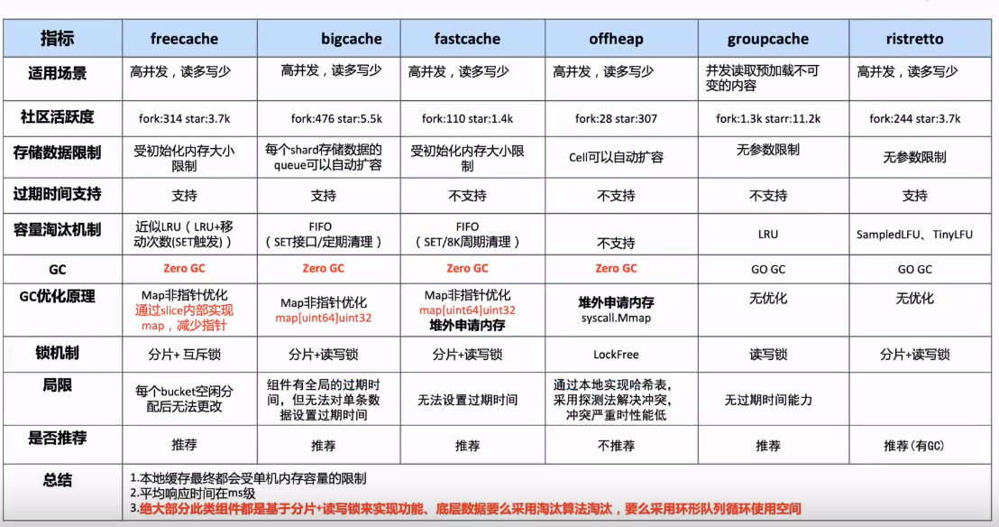

# Cache的需求

- 需要较高读写性能+命中率
- 支持按写入时间过期
- 支持淘汰策略
- 需要解决gc，大量stw扫描，cpu




## FastCache

特点:

- 线程安全(多个桶，降低并发冲突)
- 存储大量的cache实体，而且不会被GC扫描（堆内存unix.Mmap）
  - 内存映射的方式可以直接向操作系统申请内存，这块区域不归GC管。所以不管你在这块内存缓存了多少数据，都不会因为GC扫描而影响性能。
  - 但是这里分配的内存再也不会被释放，直到进程重启

- cache空间满了以后，fastcache会自动淘汰老数据块（RingBuf）
- 内存不会预先分配，随用随分配


fastcache为什么快，因为用了这些手段：

1. 使用mmap来成块的分配内存。
   - 每次直接向操作系统要64MB，这些内存都绕开了GC。
   - 每次以64KB为单位请求一个块
   - 在64KB的块内顺序存储，相当于更简单的自己实现的分配算法
2. 整个cache分成512个bucket
   - 相当于有了512个map+512个读写锁，通过这样减少了竞争
   - map类型的key和value都是整形，容量小，且对GC友好
   - 淘汰用轮换的方法+固定次数的set后再清理，解决了（或者说绕开了）碎片的问题

优点

- 快速地。多核 CPU 上的性能可扩展。请参阅下面的基准测试结果。
- 线程安全。并发 goroutine 可以读取和写入单个缓存实例。
- fastcache 设计用于在没有GC 开销的情况下存储大量条目 。
- 当达到创建时设置的最大缓存大小时，Fastcache 会自动驱逐旧条目。
- 缓存可以保存到文件 并从文件加载。


## BigCache

### 是什么？

今天我们来一起学习下BigCache，BigCache是一个go开源的缓存库。

首先这个库有那些优点：

- 存储百万的缓存条目也要非常快。
- 支持大并发访问。
- 支持在一定时间后剔除缓存条目。
- 几乎 0 GC

### 怎么用？

1.设置和获取

2.hash冲突

3.过期删除

4.定时删除

5.删除回调

### 为什么？

我来了解它的常用功能后，再来看看它是怎么设计的。

- 数据结构设计
- 核心特点
  - 为什么要分片（降低并发冲突）
  - 为什么要用map存储索引位置。（减少gc时间）
  - 为什么要用[]byte存储数据（适配map存储偏移量）


为什么要设计出bigcache（背景）？

bigcache的作者在开发项目时需要用到缓存，并有一些需求：

- cache要支持http协议访问数据。
- cache要支持 **10K** RPS (5k 写，5k 读)。
- cache对象至少保持10分钟。
- 响应时间（在没有花费在网络上的时间的情况下测量）低于。
  - 5ms – 平均值
  - 第 99.9 个百分位数为 10 毫秒
  - 第 99.999 个百分位数为 400 毫秒
- 其它.....

缓存本身需要满足的要求:

- 即使有百万的缓存对象也要非常快。
- 支持大并发访问。
- 在一定时间后剔除条目。

首先，为了满足百万的缓存对象也要非常快，需要选择一个合适的数据结构。map就是一个非常不错的的结构，可以通过O(1)的时间复杂度获取数据。示例如下：

```go

```

如上通过map存储数据，在数据量比较大并发比较高的时候会延长 GC 时间，增加访问缓存的延迟，增加内存分配次数。应为`string` 实际上底层数据结构是由两部分组成，其中包含指向字节数组的指针和数组的大小：

```go
type StringHeader struct {
    Data uintptr
    Len  int
}
```

由于 `StringHeader`中包含指针，所以每次 GC 的时候都会扫描每个指针，那么在这个巨大的 `map`中是包含了非常多的指针的，所以造成了巨大的资源消耗。

如何解决GC停顿导致的延迟：

1. 导致GC停顿的主要原因是map内保存的指针太多，导致扫描一遍需要很长时间，那可以从减少指针使用入手。（代表：Freecache）
1. 可以考虑让我们存储数据的结构直接不被扫描，那就不会有停顿了。因为垃圾回收器检查的是堆上的资源，如果不把数据放在堆上，不就解决这个问题了吗？（代表：offheap）但堆外内存很容易产生内存泄漏。
2. 可以利用Go 1.5中修复的一个issue([#9477](https://github.com/golang/go/issues/9477)), 这个issue描述了Go的开发者优化了垃圾回收时对于map的处理，如果map对象中的key和value不包含指针，那么GC 便会忽略这个 map

其次，数据都是共享的要支持并发访问就要加锁访问，当大并发访问时大量的锁冲突会降低访问效率。我们要做的是尽量避免冲突，降低并发冲突可以通过分片做到，当写入数据时可以通过hash函数和取余运算，将数据分配到不同的分片上，每个分片都有各自的读写锁，各个分片互不影响，这大大降低了并发冲突。


bigcache就是利用这些特性，首先bigcache内存结构包含一个分片数组。 每个分片有自己的存储结构(一个大循环[]bytes用来存储实际数据)，索引结构(map[uint64\]\[uint32]保存索引,key存储数据相关的hash值，value存储数据实际存储在[]bytes中的偏移量)和读写锁。


set流程


get流程


删除回调流程


缓存的实现离不开如下几种：

1. 原生 `map`
2. `sync.Map`
3. 基于以上二者封装的复合型 `map`

前两者的缺点也很明显：

1. 当 `map` 中存在大量 keys 时，GC 扫描 `map` 产生的停顿将不能忽略（针对 `map` 中存储指针或数据类型底层也是由指针实现这样的场景）
2. 加锁的粒度

提高缓存性能的手段也是明确的：

1. 减少 GC
2. `map` 中尽量避免存储指针
3. 分段（Shards）存储，减少 `lock`

具体实现：

1. 索引（index）与数据（data）分离存储的 `map` 结构
   - 这样 GC 就变成了 `map` 无指针结构 和 `[]byte` 结构的扫描问题
2. GoLang 1.5 版本的 [优化说明](https://github.com/golang/go/issues/9477): 如果 `map` 的 key 或 value 中都不含指针, GC 便会忽略这个 `map`

3. 分片解决并发竞争：bigCache 中使用了分片技术。创建 `N` 个 shard，每个 shard 包含一个带锁的 `cacheShard`，bigCache 将数据分散到不同的 `cacheShard` 进行存储。当从缓存中读写数据时，根据 `HashFunc(key)%N` 选择其中一个 `cacheShard` ，获取缓存锁 `cacheShard.lock`，这样可以大幅降低并发过程中的锁粒度。
4. [ ]byte+map\[uint64\]\[ uint64\]规避GC：从 bigCache 的 `cacheShard` 结构来看，使用了 `map[uint64]uint32` 结构，其中 key 和 value 均无指针结构，其中 value 会追加到一个全局的 `[]byte` 中，每一个 shard 中包含一个全局 `[]byte` 类型的结构 `queue.BytesQueue`。由于此字节切片除了自身对象不包含其他指针，所以 GC 对于整个 `cacheShard` 的标记时间是 `O(1)`
5. `string`, `slice`和`time.Time`都包含指针。


缺点：

1. 无持久化功能，只能用作单机缓存。
2. bigcache只能等待清理最老的元素的时候把这些"虫洞"删除掉。
3. 在添加一个元素失败后，会清理空间删除最老的元素。
4. 还会专门有一个定时的清理goroutine, 负责移除过期数据。
5. 缓存对象没有读取的时候刷新过期时间的功能，所以放入的缓存对象最终免不了过期的命运。
6. 所有的缓存对象的`lifewindow`都是一样的，比如30分钟、两小时。


参考：

https://pandaychen.github.io/2020/03/03/BIGCACHE-ANALYSIS/

https://colobu.com/2019/11/18/how-is-the-bigcache-is-fast/

https://blog.allegro.tech/2016/03/writing-fast-cache-service-in-go.html

http://liuqh.icu/2021/06/15/go/package/14-bigcache/

https://zhuanlan.zhihu.com/p/487455942


https://blog.csdn.net/xingwangc2014/article/details/86548130

https://zhuanlan.zhihu.com/p/404334020

https://www.jdon.com/52554

https://github.com/bg5sbk/go-labs


bigcache

https://mp.weixin.qq.com/s/URiURNrXHUYP1v2Q50i7Bg

https://medium.com/codex/our-go-cache-library-choices-406f2662d6b

https://blog.csdn.net/weixin_33519829/article/details/112098752

http://sarailqaq.org.cn/2020/12/06/%E8%BF%9B%E7%A8%8B%E5%86%85%E7%BC%93%E5%AD%98bigcache/


https://go.cyub.vip/concurrency/sync-rwmutex.html


今天我们学习一下 bigcache，它是一个 Golang 的缓存库。

这个缓存库它有什么优点呢？

- 他支持存储百万的缓存条目也非常快；
- 支持大并发访问；
- 支持在一定时间后剔除条目，并且它是几乎没有 GC 。

介绍完了它的有点后，我们来看一下它是怎么用的。

- 
-  
- 

介绍完它是怎么应用的后，再来看看它是怎么设计的。首先我们来看一下它的存储结构


首先整个cache 包含了n个分片的指针数组(容量必须是2的n次幂,这涉及到分片运算)，每一个分片就是一个cacheShard，里面保存了存储数据的queue([]byte)和存储索引的 map 结构。

```go
type BigCache struct {
	shards     []*cacheShard // hash分片
	lifeWindow uint64        // 全局过期时间
	clock      clock
	hash       Hasher // hash函数
	config     Config
	shardMask  uint64 // 最大分片数
	close      chan struct{}
}

type cacheShard struct {
	hashmap     map[uint64]uint32 // 存储索引的哈希表 (0 GC)
	entries     queue.BytesQueue  // 存储数据的具体数据结构
	lock        sync.RWMutex
	entryBuffer []byte           // 复用切片，用于减少分配
	onRemove    onRemoveCallback // 删除回调

	isVerbose    bool
	statsEnabled bool
	logger       Logger
	clock        clock  // 生成时间戳 时钟
	lifeWindow   uint64 // 条目驱除全局时间

	hashmapStats map[uint64]uint32 // 存储状态的哈希表
	stats        Stats             // 当前分片的缓存状态
}
```


Set流程：当数据写如bigcache时候，通过 Key 值计算一个哈希值(hashKey)，然后通过hashKey去和他的分片数量取余找到对应的分片下标，然后获取对应的分片(cacheShard)

```go
func (c *BigCache) Set(key string) ([]byte, error) {
	hashedKey := c.hash.Sum64(key)
	shard := c.getShard(hashedKey)
	return shard.set(key, hashedKey)
}

func (c *BigCache) getShard(hashedKey uint64) (shard *cacheShard) {
	return c.shards[hashedKey&c.shardMask]
}
```

找到那个对应的分片后，再通过这个 hashkey 获取 hashmap 对应的偏移量，通过这个偏移量就可以获取byte 数组对应的缓存条目。


### 详细Set流程


**第一步：获取分片**

```go
// Set saves entry under the key
func (c *BigCache) Set(key string, entry []byte) error {
	hashedKey := c.hash.Sum64(key)
	shard := c.getShard(hashedKey)
	return shard.set(key, hashedKey, entry)
}
```


首先创建一个cache实例，通过Set写入key, value：

```go
// given
cache, _ := NewBigCache(DefaultConfig(5 * time.Second))

// when
cache.Set("key", []byte("value"))
```

通过hash函数获取key的哈希值hashedKey：

```go
hashedKey := c.hash.Sum64(key)
```

通过hashedKey和分片个数 & 获取对应分片，由图可知我们找到3号分片。

```go
func (c *BigCache) getShard(hashedKey uint64) (shard *cacheShard) {
	return c.shards[hashedKey&c.shardMask]
}
```

**第二步：检查冲突**

```go
......
s.lock.Lock()

// 通过hashedKey获取s.hashmap的索引
if previousIndex := s.hashmap[hashedKey]; previousIndex != 0 { 
  // 通过索引获取对应条目
  if previousEntry, err := s.entries.Get(int(previousIndex)); err == nil {
    // 这个用到了slice的特性，切片持有源数据地址，修改切片会导致改源数组
    resetKeyFromEntry(previousEntry) 
    //remove hashkey
    delete(s.hashmap, hashedKey)
  }
}
......
```


获取到对应的分片后，首先通过hashedKey去获取分片内hashmap存储的索引（数据偏移量）；如果获取到索引不为0，表明当前hashedKey存在对应的值（存在hash冲突）；

```go
if previousIndex := s.hashmap[hashedKey]; previousIndex != 0 { 
  	........
}
```

当存在hash冲突，则通过索引获取对应数据片段的引用并将该片段值置为空，并删除hashmap存储的索引；

```go
// 通过索引获取对应条目
if previousEntry, err := s.entries.Get(int(previousIndex)); err == nil {
  // 这个用到了slice的特性，切片持有源数据地址，修改切片会导致改源数组
  resetKeyFromEntry(previousEntry) 
  //remove hashkey
  delete(s.hashmap, hashedKey)
}
```

**第三步：剔除过期数据**

检查hash冲突后，尝试剔除当前分片上的一条过期条目。首先从队列获取队尾数据（最老的条目），然后调用删除事件，并传入删除回调函数`removeOldestEntry`。

```go
if oldestEntry, err := s.entries.Peek(); err == nil { // 尝试驱逐过期条目，触发删除回调
  s.onEvict(oldestEntry, currentTimestamp, s.removeOldestEntry)
}
```

删除事件会通过当前时间和条目的存储时间求差值，然后和全局统一过期设置做对比判断是否需要删除。

```go
// 驱逐
func (s *cacheShard) onEvict(oldestEntry []byte, currentTimestamp uint64, 
                             evict func(reason RemoveReason) error) bool {
	oldestTimestamp := readTimestampFromEntry(oldestEntry)// 获取条目的存储时间
	if currentTimestamp-oldestTimestamp > s.lifeWindow { // 判断过期窗框
		evict(Expired) // 删除事件[evict -> removeOldestEntry]
		return true
	}
	return false
}
```

确认过期，执行删除回调函数`removeOldestEntry`。

```go
// 删除最旧的条目，如果条目的hash被清空，则不执行删除回调
func (s *cacheShard) removeOldestEntry(reason RemoveReason) error {
	oldest, err := s.entries.Pop() // 获取并删除最近的条目
	if err == nil {
		hash := readHashFromEntry(oldest) // 获取条目的hashedKey值
		if hash == 0 {
			// entry has been explicitly deleted with resetKeyFromEntry, ignore
			return nil
		}
		delete(s.hashmap, hash) // 从hashmap中移除hashedKey对应的索引
		s.onRemove(oldest, reason) // 执行自定义回调函数
		if s.statsEnabled { // 统计
			delete(s.hashmapStats, hash)
		}
		return nil
	}
	return err
}
```

**第四步：包装Value生成条目**


尝试剔除一条旧条目后，开始包装条目，写入`buffer`；`buffer`是一个可复用的`[]byte`，可以减少内存分配。

1. 写入当前时间`timestamp`占`8`位。
2. 写入`hashedKey`占`8`位
3. 写入`KeyLength`长度占`2`位
4. 写入`Key`值占`n`位
5. 写入`entry (Value)` 值占`m`位

```go
// |  8 bytes  |  8 bytes  |  2 bytes  | n byte | m bytes |
// | timestamp | hashValue | KeyLength |   Key  |  entry  |
func wrapEntry(timestamp uint64, hash uint64, key string, entry []byte,
               buffer *[]byte) []byte {
	keyLength := len(key)
	blobLength := len(entry) + headersSizeInBytes + keyLength

	if blobLength > len(*buffer) {
		*buffer = make([]byte, blobLength)
	}
	blob := *buffer

	binary.LittleEndian.PutUint64(blob, timestamp)
	binary.LittleEndian.PutUint64(blob[timestampSizeInBytes:], hash)
	binary.LittleEndian.PutUint16(blob[timestampSizeInBytes+hashSizeInBytes:],
                                uint16(keyLength))
	copy(blob[headersSizeInBytes:], key)
	copy(blob[headersSizeInBytes+keyLength:], entry)

	return blob[:blobLength]
}
```

**第五步：尝试写入**


```go
for { // 循环尝试添加条目到切片末尾，添加失败尝试驱逐
  if index, err := s.entries.Push(w); err == nil {
    s.hashmap[hashedKey] = uint32(index)
    s.lock.Unlock()
    return nil
  }
  if s.removeOldestEntry(NoSpace) != nil { // 尝试驱逐过期条目
    s.lock.Unlock()
    return fmt.Errorf("entry is bigger than max shard size")
  }
}
```

包装好条目后，将条目写入到分片的队列里；写入队列成功后再在`hashmap`上建立`hashedKey`对应的索引(`offset`)并返回；添加失败，则尝试剔除旧数据，循环如上步骤。

### 详细Get流程


**第一步：获取分片同上**

```go
func (c *BigCache) Get(key string) ([]byte, error) {
	hashedKey := c.hash.Sum64(key)
	shard := c.getShard(hashedKey)
	return shard.get(key, hashedKey)
}
```

**第二步：获取条目**

```go
func (s *cacheShard) get(key string, hashedKey uint64) ([]byte, error) {
	s.lock.RLock()                                    // 加锁
	wrappedEntry, err := s.getWrappedEntry(hashedKey) // 获取包裹的条目
	if err != nil {
		s.lock.RUnlock()
		return nil, err
	}
	if entryKey := readKeyFromEntry(wrappedEntry); key != entryKey {
		s.lock.RUnlock()
		s.collision()
		if s.isVerbose {
			s.logger.Printf("Collision detected. Both %q and %q have the same hash %x", key, entryKey, hashedKey)
		}
		return nil, ErrEntryNotFound
	}
	entry := readEntry(wrappedEntry)
	s.lock.RUnlock()
	s.hit(hashedKey)

	return entry, nil
}
```

通过hashedKey获取报告条目。

```go
func (s *cacheShard) getWrappedEntry(hashedKey uint64) ([]byte, error) {
	itemIndex := s.hashmap[hashedKey]

	if itemIndex == 0 {
		s.miss()
		return nil, ErrEntryNotFound
	}

	wrappedEntry, err := s.entries.Get(int(itemIndex))
	if err != nil {
		s.miss()
		return nil, err
	}

	return wrappedEntry, err
}
```

在通过包裹条目wrappendEntry获取entryKey对比key是否相等。在通过包裹条目wrappendEntry获取entry并返回

###  


### 分片+锁


### map[uint64]uint32


那 get 流程 get 流程其实就是说我们通过 key 来查找他们的 value 怎么会先计算出希，然后然后找到对应的分片，再找到卖，然后通过好这好几只在卖里面找到 byte 索引，找到索引过后再从二进再从 byte 数组里面去取出这个索引对应的 value 值，然后再把它再解析这个条目里面的 value 然后最终取得的 value 这是他的 get 流程。

那我们回过头来看我们这个希这个开启，她为什么这样设计？他为什么要设计出分片？首先如果说我们这个不用开启，他如果说只有一个分片的话，它会导致一个问题，就是我们在并发读写的时候，我们如何保证数据一致？这其实你要保证数据证你就只能加锁，但加锁会降低我们的效率。

如果说我们现在有 10 个人来，他 10 个人都需要访问这个速度，那么每个人都会在这里等待，它是串行执行的一个，执行完再交给下一个。但如果说我们把这个数据分片过后，我们 10 个人可能说他要查询的 key 他是不一样的，我们可以分散到不同的分片上，每个分片上带有自己的数。比如说我们 10 个人可能他需要 10 个人查询的 key 分，通过哈希过后可以分布到三个分片上，那么他在这一秒同时执行，这一秒他就可以同时执行这三个查询。而降低了我们的冲突。我们的并发冲突它就会提升更多的效率，它就会提升效率。所以说我们可以获得更大的查询和更低的延迟。

然后还有一个就是他这里利用了一个 map 的结构 map 结构来存储具体数据的索引。为什么要这样设计？其实是因为如果我们用 map 直接存储数据的话，那么可能会因为我们这里只能存储类型的或者说这个东西它都属于是指针类型的。如果说我们存储了大量的条目过后，它就会导致我们的 GC 性，我们导致 GC 的会导致严重的 GC 耗时。我们通过这个我们通过一个时间可以看出，我们通过这个时间我们可以看出，如果说我们这个 map 结构如果存的是 string 类型或者说是指针类型，我说这个数值是我们这个 map 的值是存了 key 或 value 是存了指针类型的猫，它就会造成严重的 GC 问题，从而影响我们的查询速度，从而查询和延迟。

为什么会导致这个问题？因为我们在 GC 的时候，这个 G GC 会取我们的 map 会把我们整个 map 扫描一遍。它扫描整个 map 的时候，它每一个 map 的结构它都会拿出来，然后判断一下他是否还有引用对吧。如果说他是指针，他又会判断一下他是否还有引用，他会去把每一个元素都扫了一遍，这样就会非常耗时。

说我们的 map 结构里面存的是技术类型和 int float 布鲁布尔类型其实就在扫描的时候，他就会忽略他们，因为基础类型没有办法指向一个新的，他就会忽略他们的，然后降级我们的查询效果，降低我们的查询延时，从而提高我们的效率。这就是，别开启最。


# 5W2H分析法

1. who: 需要哪些人来做, 做这个产品的服务对象, 业务方是谁
2. why: 为什么要做这个东西, 它的 价值 在哪里
3. where: 这个产品最终在一个项目链路中在什么位置
4. what: 实现这个产品需要做出哪些 功能
5. how: 怎么去 实现 这些功能, 是否有效率更高的方法, 社区是否已经有成熟的解决方案.
6. when: 需要多久搞定, 什么时候开始搞
7. how much: 需要投入多少人/日

**麦肯锡7步分析法**

1. 描述问题
2. 分析问题
3. 剔除所有非关键问题
4. 指定详细工作计划
5. 进行实验分析
6. 调研结果
7. 教会别人


学习方法论一：适合周期短，模块化，简单事物的学习如bigcache

1. 这个问题、东西是什么？
2. 这个东西解决了什么？
   1. 这个东西怎么用
3. 这个东西是怎么解决的？
4. 为什么这个东西，方法可以解决，代价是啥，效率如何？
5. 有没有其他的方式可以解决当前问题？


## FreeCache

特点：

- 能存储数亿条记录（entry） 。
- 零GC开销。
- 高并发线程安全访问。
- 纯Golang代码实现。
- 支持记录（entry）过期。
- 接近LRU的替换算法。
- 严格限制内存的使用。
- 提供一个测试用的服务器，支持一些基本 Redis 命令。
- 支持迭代器。

set操作为什么高效

- 采用二分查找，极大的减少查找entry索引的时间开销。slot切片上的entry索引是根据hash16值有序排列的，对于有序集合，可以采用二分查找算法进行搜索，假设缓存了n个key，那么查找entry索引的时间复杂度为log2(n * 2^-16) = log2(n) - 16。

- 对于key不存在的情况下（找不到entry索引）。
  如果Ringbuf容量充足，则直接将entry追加到环尾，时间复杂度为O(1)。
  如果RingBuf不充足，需要将一些key移除掉，情况会复杂点，后面会单独讲解这块逻辑，不过freecache通过一定的措施，保证了移除数据的时间复杂度为O(1)，所以对于RingBuf不充足时，entry追加操作的时间复杂度也O(1)。

- 对于已经存在的key（找到entry索引）。
  如果原来给entry的value预留的容量充足的话，则直接更新原来entry的头部和value，时间复杂度为O(1)。
  如果原来给entry的value预留的容量不足的话，freecache为了避免移动底层数组数据，不直接对原来的entry进行扩容，而是将原来的entry标记为删除（懒删除），然后在环形缓冲区RingBuf的环尾追加新的entry，时间复杂度为O(1)。


key过期

- 对于过期的数据，freecache会让它继续存储在RingBuf中，RingBuf从一开始初始化之后，就固定不变了，是否删掉数据，对RingBuf的实际占用空间不会产生影响。
- 当get到一个过期缓存时，freecache会删掉缓存的entry索引（但是不会将缓存从RingBuf中移除），然后对外报ErrNotFound错误。
- 当RingBuf的容量不足时，会从环头开始遍历，如果key已经过期，这时才会将它删除掉。
- 如果一个key已经过期时，在它被freecache删除之前，如果又重新set进来（过期不会主动删除entry索引，理论上有被重新set的可能），过期的entry容量充足的情况下，则会重新复用这个entry。
- freecache这种过期机制，一方面减少了维护过期数据的工作，另一方面，freecache底层存储是采用数组来实现，要求缓存数据必须连续，缓存过期的剔除会带来空间碎片，挪动数组来维持缓存数据的连续性不是一个很好的选择。

freecache的不足

- 需要一次性申请所有缓存空间。用于实现segment的RingBuf切片，从缓存被创建之后，其容量就是固定不变的，申请的内存也会一直被占用着，空间换时间，确实避免不了。
- freecache的entry置换算法不是完全LRU，而且在某些情况下，可能会把最近经常被访问的缓存置换出去。
  entry索引切片slotsData无法一次性申请足够的容量，当slotsData容量不足时，会进行空间容量x2的扩容，这种自动扩容机制，会带来一定的性能开销。
- 由于entry过期时，不会主动清理缓存数据，这些过期缓存的entry索引还会继续保存slot切片中，这种机制会加快entry索引切片提前进行扩容，而实际上除掉这些过期缓存的entry索引，entry索引切片的容量可能还是完全充足的。
- 为了保证LRU置换能够正常进行，freecache要求entry的大小不能超过缓存大小的1/1024，而且这个限制还不给动态修改，具体可以参考github上的issues。

使用freecache的注意事项

- 缓存的数据如果可以的话，大小尽量均匀一点，可以减少RingBuf容量不足时的置换工作开销。
- 缓存的数据不易过大，这样子才能缓存更多的key，提高缓存命中率。


参考：

https://blog.csdn.net/chizhenlian/article/details/108435024

https://www.cxybb.com/article/baidu_32452525/118199343

https://juejin.cn/post/7072121084136882183


1.上线字典表替代方案

2.资产管理开发完成

3.开发资产统计


## 解决问题：循序渐进的方法

**1.确定问题所在**

首先最好确定需要解决的问题。

这意味着花时间全面评估情况，**将症状与原因分开**。诊断的目的是了解痛点和原因。这需要时间，可能还要做些调研，揭示问题背后的潜在问题。

**2.确定根本原因**

确定问题所在之后，需要找出原因。

- 背后的原因是什么？
- 是什么原因导致的？
- 可否将其定量或定性？
- 核心层面发生了什么情况？

因为在您努力解决问题过程中，您会想要找到一种可以治本而不只是治标的解决方案，对吧？  所以，这也需要花时间调查情况。收集信息，分析调查结果，并改进诊断。

**3.找到多种解决方案**

要成为优秀的问题解决者，需要打破常规，创造性地思考。不要满足于您找到的第一种解决方案。要全力以赴继续寻找。找到尽可能多的备选解决方案。然后再找一些。

这可能意味着在不寻常的地方或从不寻常的来源寻找解决方案 - 与其他同事交流、保持开放的心态，或者乐于接受思想或观点的交流。无论如何，在确定一系列备选解决方案后，要对它们进行分析。

**4.找到最有效的解决方案**

这一点是否说起来容易，做起来难？并非如此。我们可以按逻辑进行处理。回答以下问题：

- 此方案技术上是否可行？
- 此方案是否可扩展？
- 您是否拥有相应资源？
- 有何风险？能否设法应对风险？
- 您的解决方案是否会让尽可能多的人受益？
- 效果可否进行衡量？如何衡量？

**5.规划和实施解决方案**

这部分也需要认真考虑。制定严密的计划来执行您的解决方案。  需要涵盖实施计划的人员、内容、时间和方式。

同样重要的是，您需要考虑如何确定自己的解决方案是否成功，这就来到了最后一步。

**6.衡量解决方案是否成功**

如何根据您的目标进行衡量？是否已达到目标？是否控制在预算范围内？工作是否已完成？能否看到可衡量的结果？ 

评估解决方案成功与否是至关重要也是经常被忽略的一步，因为它能清楚地展示您的解决方案是否正确，或者是否需要返回第一步重新来过。因为有效解决问题的一个关键环节是做好出错的准备，并从错误中吸取教训。

请记住，所有问题都只是有待解开的谜题。练习使用上述六个步骤，培养解决问题的敏锐度，您会发现您的能力深受重视。


