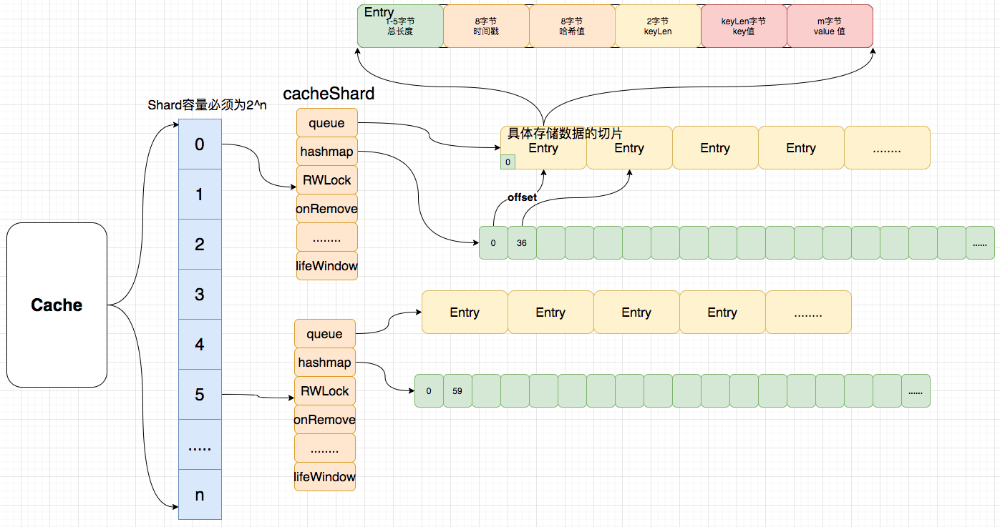
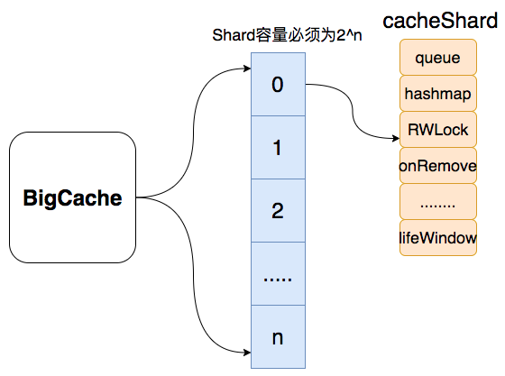
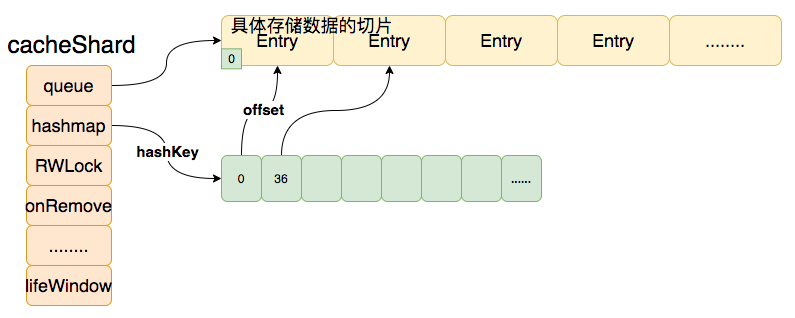
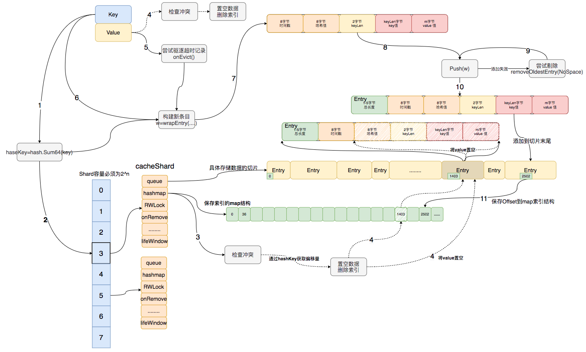
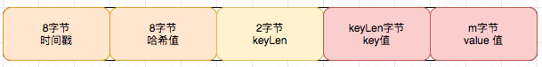
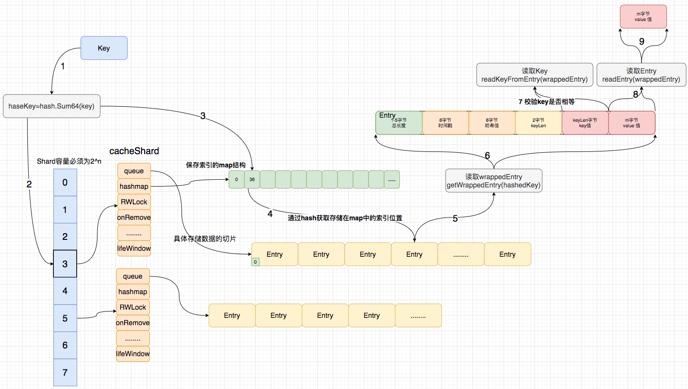
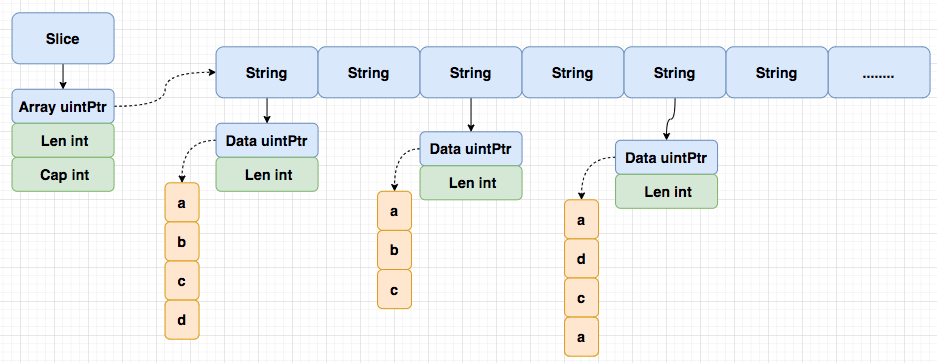

# BigCache

## 1.简介

今天我们来学习bigcache，bigcache是一个 Golang 的本地缓存库，同类型的缓存库还有fastcache，freecache等。

作为bigcache它有什么特性和优点呢？

1. 他支持存储百万的缓存条目也非常快；
2. 支持大并发访问；
3. 支持在一定时间后剔除条目;
4. 几乎 0 GC;

## 2.应用

介绍完了它的有点后，我们来看一下它是怎么用的。

- 
- 
- 

介绍完它是怎么应用的后，再来看看它是怎么设计的。首先我们来看一下它的存储结构



首先整个cache 包含了n个分片的指针数组(容量必须是2的n次幂,这涉及到分片运算)，每一个分片就是一个cacheShard，里面保存了存储数据的queue([]byte)和存储索引的 map 结构。

```go
type BigCache struct {
	shards     []*cacheShard // hash分片
	lifeWindow uint64        // 全局过期时间
	clock      clock
	hash       Hasher // hash函数
	config     Config
	shardMask  uint64 // 最大分片数
	close      chan struct{}
}

type cacheShard struct {
	hashmap     map[uint64]uint32 // 存储索引的哈希表 (0 GC)
	entries     queue.BytesQueue  // 存储数据的具体数据结构
	lock        sync.RWMutex
	entryBuffer []byte           // 复用切片，用于减少分配
	onRemove    onRemoveCallback // 删除回调

	isVerbose    bool
	statsEnabled bool
	logger       Logger
	clock        clock  // 生成时间戳 时钟
	lifeWindow   uint64 // 条目驱除全局时间

	hashmapStats map[uint64]uint32 // 存储状态的哈希表
	stats        Stats             // 当前分片的缓存状态
}
```



Set流程：当数据写如bigcache时候，通过 Key 值计算一个哈希值(hashKey)，然后通过hashKey去和他的分片数量取余找到对应的分片下标，然后获取对应的分片(cacheShard)

```go
func (c *BigCache) Set(key string) ([]byte, error) {
	hashedKey := c.hash.Sum64(key)
	shard := c.getShard(hashedKey)
	return shard.set(key, hashedKey)
}

func (c *BigCache) getShard(hashedKey uint64) (shard *cacheShard) {
	return c.shards[hashedKey&c.shardMask]
}
```

找到那个对应的分片后，再通过这个 hashkey 获取 hashmap 对应的偏移量，通过这个偏移量就可以获取byte 数组对应的缓存条目。



### 2-1.详细Set流程



**第一步：获取分片**

```go
// Set saves entry under the key
func (c *BigCache) Set(key string, entry []byte) error {
	hashedKey := c.hash.Sum64(key)
	shard := c.getShard(hashedKey)
	return shard.set(key, hashedKey, entry)
}
```


首先创建一个cache实例，通过Set写入key, value：

```go
// given
cache, _ := NewBigCache(DefaultConfig(5 * time.Second))

// when
cache.Set("key", []byte("value"))
```

通过hash函数获取key的哈希值hashedKey：

```go
hashedKey := c.hash.Sum64(key)
```

通过hashedKey和分片个数 & 获取对应分片，由图可知我们找到3号分片。

```go
func (c *BigCache) getShard(hashedKey uint64) (shard *cacheShard) {
	return c.shards[hashedKey&c.shardMask]
}
```

**第二步：检查冲突**

```go
......
s.lock.Lock()

// 通过hashedKey获取s.hashmap的索引
if previousIndex := s.hashmap[hashedKey]; previousIndex != 0 { 
  // 通过索引获取对应条目
  if previousEntry, err := s.entries.Get(int(previousIndex)); err == nil {
    // 这个用到了slice的特性，切片持有源数据地址，修改切片会导致改源数组
    resetKeyFromEntry(previousEntry) 
    //remove hashkey
    delete(s.hashmap, hashedKey)
  }
}
......
```


获取到对应的分片后，首先通过hashedKey去获取分片内hashmap存储的索引（数据偏移量）；如果获取到索引不为0，表明当前hashedKey存在对应的值（存在hash冲突）；

```go
if previousIndex := s.hashmap[hashedKey]; previousIndex != 0 { 
  	........
}
```

当存在hash冲突，则通过索引获取对应数据片段的引用并将该片段值置为空，并删除hashmap存储的索引；

```go
// 通过索引获取对应条目
if previousEntry, err := s.entries.Get(int(previousIndex)); err == nil {
  // 这个用到了slice的特性，切片持有源数据地址，修改切片会导致改源数组
  resetKeyFromEntry(previousEntry) 
  //remove hashkey
  delete(s.hashmap, hashedKey)
}
```

**第三步：剔除过期数据**

检查hash冲突后，尝试剔除当前分片上的一条过期条目。首先从队列获取队尾数据（最老的条目），然后调用删除事件，并传入删除回调函数`removeOldestEntry`。

```go
if oldestEntry, err := s.entries.Peek(); err == nil { // 尝试驱逐过期条目，触发删除回调
  s.onEvict(oldestEntry, currentTimestamp, s.removeOldestEntry)
}
```

删除事件会通过当前时间和条目的存储时间求差值，然后和全局统一过期设置做对比判断是否需要删除。

```go
// 驱逐
func (s *cacheShard) onEvict(oldestEntry []byte, currentTimestamp uint64, 
                             evict func(reason RemoveReason) error) bool {
	oldestTimestamp := readTimestampFromEntry(oldestEntry)// 获取条目的存储时间
	if currentTimestamp-oldestTimestamp > s.lifeWindow { // 判断过期窗框
		evict(Expired) // 删除事件[evict -> removeOldestEntry]
		return true
	}
	return false
}
```

确认过期，执行删除回调函数`removeOldestEntry`。

```go
// 删除最旧的条目，如果条目的hash被清空，则不执行删除回调
func (s *cacheShard) removeOldestEntry(reason RemoveReason) error {
	oldest, err := s.entries.Pop() // 获取并删除最近的条目
	if err == nil {
		hash := readHashFromEntry(oldest) // 获取条目的hashedKey值
		if hash == 0 {
			// entry has been explicitly deleted with resetKeyFromEntry, ignore
			return nil
		}
		delete(s.hashmap, hash) // 从hashmap中移除hashedKey对应的索引
		s.onRemove(oldest, reason) // 执行自定义回调函数
		if s.statsEnabled { // 统计
			delete(s.hashmapStats, hash)
		}
		return nil
	}
	return err
}
```

**第四步：包装Value生成条目**



尝试剔除一条旧条目后，开始包装条目，写入`buffer`；`buffer`是一个可复用的`[]byte`，可以减少内存分配。

1. 写入当前时间`timestamp`占`8`位。
2. 写入`hashedKey`占`8`位
3. 写入`KeyLength`长度占`2`位
4. 写入`Key`值占`n`位
5. 写入`entry (Value)` 值占`m`位

```go
// |  8 bytes  |  8 bytes  |  2 bytes  | n byte | m bytes |
// | timestamp | hashValue | KeyLength |   Key  |  entry  |
func wrapEntry(timestamp uint64, hash uint64, key string, entry []byte,
               buffer *[]byte) []byte {
	keyLength := len(key)
	blobLength := len(entry) + headersSizeInBytes + keyLength

	if blobLength > len(*buffer) {
		*buffer = make([]byte, blobLength)
	}
	blob := *buffer

	binary.LittleEndian.PutUint64(blob, timestamp)
	binary.LittleEndian.PutUint64(blob[timestampSizeInBytes:], hash)
	binary.LittleEndian.PutUint16(blob[timestampSizeInBytes+hashSizeInBytes:],
                                uint16(keyLength))
	copy(blob[headersSizeInBytes:], key)
	copy(blob[headersSizeInBytes+keyLength:], entry)

	return blob[:blobLength]
}
```

**第五步：尝试写入**


```go
for { // 循环尝试添加条目到切片末尾，添加失败尝试驱逐
  if index, err := s.entries.Push(w); err == nil {
    s.hashmap[hashedKey] = uint32(index)
    s.lock.Unlock()
    return nil
  }
  if s.removeOldestEntry(NoSpace) != nil { // 尝试驱逐过期条目
    s.lock.Unlock()
    return fmt.Errorf("entry is bigger than max shard size")
  }
}
```

包装好条目后，将条目写入到分片的队列里；写入队列成功后再在`hashmap`上建立`hashedKey`对应的索引(`offset`)并返回；添加失败，则尝试剔除旧数据，循环如上步骤。

### 2-2.详细Get流程



**第一步：获取分片同上**

```go
func (c *BigCache) Get(key string) ([]byte, error) {
	hashedKey := c.hash.Sum64(key)
	shard := c.getShard(hashedKey)
	return shard.get(key, hashedKey)
}
```

**第二步：获取条目**

```go
func (s *cacheShard) get(key string, hashedKey uint64) ([]byte, error) {
	s.lock.RLock()                                    // 加锁
	wrappedEntry, err := s.getWrappedEntry(hashedKey) // 获取包裹的条目
	if err != nil {
		s.lock.RUnlock()
		return nil, err
	}
	if entryKey := readKeyFromEntry(wrappedEntry); key != entryKey {
		s.lock.RUnlock()
		s.collision()
		if s.isVerbose {
			s.logger.Printf("Collision detected. Both %q and %q have the same hash %x", key, entryKey, hashedKey)
		}
		return nil, ErrEntryNotFound
	}
	entry := readEntry(wrappedEntry)
	s.lock.RUnlock()
	s.hit(hashedKey)

	return entry, nil
}
```

通过hashedKey获取报告条目。

```go
func (s *cacheShard) getWrappedEntry(hashedKey uint64) ([]byte, error) {
	itemIndex := s.hashmap[hashedKey]

	if itemIndex == 0 {
		s.miss()
		return nil, ErrEntryNotFound
	}

	wrappedEntry, err := s.entries.Get(int(itemIndex))
	if err != nil {
		s.miss()
		return nil, err
	}

	return wrappedEntry, err
}
```

在通过包裹条目wrappendEntry获取entryKey对比key是否相等。在通过包裹条目wrappendEntry获取entry并返回

## 3.设计思想

我来了解它的常用功能后，再来看看它是怎么设计的。

- 数据结构设计
- 核心特点
  - 为什么要分片（降低并发冲突）
  - 为什么要用map存储索引位置。（减少gc时间）
  - 为什么要用[]byte存储数据（适配map存储偏移量）

### 3-1.map[uint64]uint32 (绕过GC)

缓存的实现离不开以下几种：

1. 原生 `map`+锁
2. `sync.Map`
3. 基于以上二者封装的复合型 `map`

前两者很明显的缺点：

1. 当 `map` 中存在大量 keys 时，GC 扫描 `map` 产生的停顿将不能忽略（针对 `map` 中存储带有指针类型的场景，列1）
2. 加锁的粒度不好控制

列1：

```go
package main

import (
	"fmt"
	"runtime"
	"strconv"
	"time"
)

const N = 30e6

func mapInt32PointerTest()  {
	// Big map with a pointer in the value
	m := make(map[int32]*int32)
	for i := 0; i < N; i++ {
		n := int32(i)
		m[n] = &n
	}
	runtime.GC()
	fmt.Printf("With %T, GC took %s\n", m, timeGC())
	_ = m[0] // Preserve m until here, hopefully
}

func mapNInt32PointerTest()  {
	// Big map (preallocated) with a pointer in the value
	m := make(map[int32]*int32, N)
	for i := 0; i < N; i++ {
		n := int32(i)
		m[n] = &n
	}
	runtime.GC()
	fmt.Printf("With %T, GC took %s\n", m, timeGC())
	_ = m[0] // Preserve m until here, hopefully
}

func mapInt32Test()  {
	// Big map, no pointer in the value
	m := make(map[int32]int32)
	for i := 0; i < N; i++ {
		n := int32(i)
		m[n] = n
	}
	runtime.GC()
	fmt.Printf("With %T, GC took %s\n", m, timeGC())
	_ = m[0]
}

func mapNInt32Test()  {
	// Big map, no pointer in the value, map fully pre-allocated
	m := make(map[int32]int32, N)
	for i := 0; i < N; i++ {
		m[int32(i)] = int32(i)
	}
	runtime.GC()
	fmt.Printf("With %T, GC took %s\n", m, timeGC())
	_ = m[0]
}

func mapStringTest()  {
	// Big map with a pointer in the key
	m := make(map[string]string)
	for i := 0; i < N; i++ {
		m[strconv.Itoa(i)] = strconv.Itoa(i)
	}
	runtime.GC()
	fmt.Printf("With %T, GC took %s\n", m, timeGC())
	_ = m["0"]
}

func mapNStringTest()  {
	// Big map with a pointer in the key, map fully pre-allocated
	m := make(map[string]string, N)
	for i := 0; i < N; i++ {
		m[strconv.Itoa(i)] = strconv.Itoa(i)
	}
	runtime.GC()
	fmt.Printf("With %T, GC took %s\n", m, timeGC())
	_ = m["0"]
}

func structInt32Test()  {
	type t struct {
		p, q int32
	}
	var s []t
	for i := 0; i < N; i++ {
		n := int32(i)
		s = append(s, t{n, n})
	}
	runtime.GC()
	fmt.Printf("With a plain slice (%T), GC took %s\n", s, timeGC())
	_ = s[0]
}

func structNInt32Test()  {
	type t struct {
		p, q int32
	}
	s := make([]t, 0, N)
	for i := 0; i < N; i++ {
		s = append(s, t{int32(i), int32(i)})
	}
	runtime.GC()
	fmt.Printf("With a plain slice (%T), GC took %s\n", s, timeGC())
	_ = s[0]
}

func sliceStringTest(){
	var s []string
	for i := 0; i < N; i++ {
		s = append(s, strconv.Itoa(i))
	}
	runtime.GC()
	fmt.Printf("With a plain slice (%T), GC took %s\n", s, timeGC())
	_ = s[0]
}

func sliceNStringTest(){
	s := make([]string, N)
	for i := 0; i < N; i++ {
		s[i] = strconv.Itoa(i)
	}
	runtime.GC()
	fmt.Printf("With a plain slice (%T), GC took %s\n", s, timeGC())
	_ = s[0]
}

func main() {
	mapInt32PointerTest()
	mapNInt32PointerTest()
	mapInt32Test()
	mapNInt32Test()
	mapStringTest()
	mapNStringTest()
	structInt32Test()
	structNInt32Test()
	sliceStringTest()
	sliceNStringTest()
}

func timeGC() time.Duration {
	start := time.Now()
	runtime.GC()
	return time.Since(start)
}
```

```bash
# 结果
With map[int32]*int32, GC took 1.361993678s
With map[int32]*int32, GC took 1.833904147s
With map[int32]int32, GC took 56.67087ms
With map[int32]int32, GC took 1.212581ms
With map[string]string, GC took 5.899666241s
With map[string]string, GC took 3.243479909s
With a plain slice ([]main.t), GC took 411.346µs
With a plain slice ([]main.t), GC took 318.365µs
With a plain slice ([]string), GC took 312.079401ms
With a plain slice ([]string), GC took 306.468481ms
```

如上通过map存储数据，在数据量比较大的时候会增加 GC 时间，导致访问缓存延迟。

用[]\[string]为例：因为`string` 底层数据结构是由两部分组成，其中包含指向字节数组的指针和数组的大小：

```go
type StringHeader struct {
    Data uintptr
    Len  int
}
```

由于 `StringHeader`中包含指针，所以每次 GC 的时候都会扫描每个指针，那么在这个巨大的 `map`中是包含了非常多的指针的，在扫描时就会造成了巨大的资源消耗。



如何解决大量指针被扫描导致GC停顿：

1. 导致GC停顿的主要原因是map内保存的指针太多，导致扫描一遍需要很长时间，那可以从减少指针使用入手。（代表：Freecache）
1. 可以考虑让我们存储数据的结构直接不被扫描，那就不会有停顿了。因此可以通过自己申请管理内存，通过自己申请的内存 GC 就不会来管理这些内存，但堆外内存很容易产生内存泄漏（代表：fastcache）。
2. 可以利用Go 1.5中修复的一个issue([#9477](https://github.com/golang/go/issues/9477)), 这个issue描述了Go的开发者优化了垃圾回收时对于map的处理，如果map对象中的key和value不包含指针，那么GC 便会忽略这个 map（代表：bigcache）

bigcache通过[]bytes+map[uint64]uint32绕过了GC扫描，即使存储百万的缓存条目也非常快。

```go
type cacheShard struct {
	hashmap     map[uint64]uint32 // 存储索引的哈希表 (0 GC)
	entries     queue.BytesQueue  // 存储数据的具体数据结构
	lock        sync.RWMutex
	......
}

type BytesQueue struct {
	full         bool   // 是否已满
	array        []byte // 实际存储字节切片
	capacity     int    // array 容量
	head         int    // head索引位置
	tail         int    // tail索引位置
	count        int    // 存储条数
	rightMargin  int    // 左边距 TODO
	headerBuffer []byte // 序列化 头复用切片
	verbose      bool   // 是否开启打印详情
}
```


其次，数据都是共享的要支持并发访问就要加锁访问，当大并发访问时大量的锁冲突会降低访问效率。我们要做的是尽量避免冲突，降低并发冲突可以通过分片做到，当写入数据时可以通过hash函数和取余运算，将数据分配到不同的分片上，每个分片都有各自的读写锁，各个分片互不影响，这大大降低了并发冲突。


bigcache就是利用这些特性，首先bigcache内存结构包含一个分片数组。 每个分片有自己的存储结构(一个大循环[]bytes用来存储实际数据)，索引结构(map[uint64\]\[uint32]保存索引,key存储数据相关的hash值，value存储数据实际存储在[]bytes中的偏移量)和读写锁。


2. 

提高缓存性能的手段也是明确的：

1. 减少 GC
2. `map` 中尽量避免存储指针
3. 分段（Shards）存储，减少 `lock`

具体实现：

1. 索引（index）与数据（data）分离存储的 `map` 结构
   - 这样 GC 就变成了 `map` 无指针结构 和 `[]byte` 结构的扫描问题
2. GoLang 1.5 版本的 [优化说明](https://github.com/golang/go/issues/9477): 如果 `map` 的 key 或 value 中都不含指针, GC 便会忽略这个 `map`

3. 分片解决并发竞争：bigCache 中使用了分片技术。创建 `N` 个 shard，每个 shard 包含一个带锁的 `cacheShard`，bigCache 将数据分散到不同的 `cacheShard` 进行存储。当从缓存中读写数据时，根据 `HashFunc(key)%N` 选择其中一个 `cacheShard` ，获取缓存锁 `cacheShard.lock`，这样可以大幅降低并发过程中的锁粒度。
4. [ ]byte+map\[uint64\]\[ uint64\]规避GC：从 bigCache 的 `cacheShard` 结构来看，使用了 `map[uint64]uint32` 结构，其中 key 和 value 均无指针结构，其中 value 会追加到一个全局的 `[]byte` 中，每一个 shard 中包含一个全局 `[]byte` 类型的结构 `queue.BytesQueue`。由于此字节切片除了自身对象不包含其他指针，所以 GC 对于整个 `cacheShard` 的标记时间是 `O(1)`
5. `string`, `slice`和`time.Time`都包含指针。


缺点：

1. 无持久化功能，只能用作单机缓存。
2. bigcache只能等待清理最老的元素的时候把这些"虫洞"删除掉。
3. 在添加一个元素失败后，会清理空间删除最老的元素。
4. 还会专门有一个定时的清理goroutine, 负责移除过期数据。
5. 缓存对象没有读取的时候刷新过期时间的功能，所以放入的缓存对象最终免不了过期的命运。
6. 所有的缓存对象的`lifewindow`都是一样的，比如30分钟、两小时。


参考：

https://pandaychen.github.io/2020/03/03/BIGCACHE-ANALYSIS/

https://colobu.com/2019/11/18/how-is-the-bigcache-is-fast/

https://blog.allegro.tech/2016/03/writing-fast-cache-service-in-go.html

http://liuqh.icu/2021/06/15/go/package/14-bigcache/

https://zhuanlan.zhihu.com/p/487455942


https://blog.csdn.net/xingwangc2014/article/details/86548130

https://zhuanlan.zhihu.com/p/404334020

https://www.jdon.com/52554

https://github.com/bg5sbk/go-labs


bigcache

https://mp.weixin.qq.com/s/URiURNrXHUYP1v2Q50i7Bg

https://medium.com/codex/our-go-cache-library-choices-406f2662d6b

https://blog.csdn.net/weixin_33519829/article/details/112098752

http://sarailqaq.org.cn/2020/12/06/%E8%BF%9B%E7%A8%8B%E5%86%85%E7%BC%93%E5%AD%98bigcache/


https://go.cyub.vip/concurrency/sync-rwmutex.html


那 get 流程 get 流程其实就是说我们通过 key 来查找他们的 value 怎么会先计算出希，然后然后找到对应的分片，再找到卖，然后通过好这好几只在卖里面找到 byte 索引，找到索引过后再从二进再从 byte 数组里面去取出这个索引对应的 value 值，然后再把它再解析这个条目里面的 value 然后最终取得的 value 这是他的 get 流程。

那我们回过头来看我们这个希这个开启，她为什么这样设计？他为什么要设计出分片？首先如果说我们这个不用开启，他如果说只有一个分片的话，它会导致一个问题，就是我们在并发读写的时候，我们如何保证数据一致？这其实你要保证数据证你就只能加锁，但加锁会降低我们的效率。

如果说我们现在有 10 个人来，他 10 个人都需要访问这个速度，那么每个人都会在这里等待，它是串行执行的一个，执行完再交给下一个。但如果说我们把这个数据分片过后，我们 10 个人可能说他要查询的 key 他是不一样的，我们可以分散到不同的分片上，每个分片上带有自己的数。比如说我们 10 个人可能他需要 10 个人查询的 key 分，通过哈希过后可以分布到三个分片上，那么他在这一秒同时执行，这一秒他就可以同时执行这三个查询。而降低了我们的冲突。我们的并发冲突它就会提升更多的效率，它就会提升效率。所以说我们可以获得更大的查询和更低的延迟。

然后还有一个就是他这里利用了一个 map 的结构 map 结构来存储具体数据的索引。为什么要这样设计？其实是因为如果我们用 map 直接存储数据的话，那么可能会因为我们这里只能存储类型的或者说这个东西它都属于是指针类型的。如果说我们存储了大量的条目过后，它就会导致我们的 GC 性，我们导致 GC 的会导致严重的 GC 耗时。我们通过这个我们通过一个时间可以看出，我们通过这个时间我们可以看出，如果说我们这个 map 结构如果存的是 string 类型或者说是指针类型，我说这个数值是我们这个 map 的值是存了 key 或 value 是存了指针类型的猫，它就会造成严重的 GC 问题，从而影响我们的查询速度，从而查询和延迟。

为什么会导致这个问题？因为我们在 GC 的时候，这个 G GC 会取我们的 map 会把我们整个 map 扫描一遍。它扫描整个 map 的时候，它每一个 map 的结构它都会拿出来，然后判断一下他是否还有引用对吧。如果说他是指针，他又会判断一下他是否还有引用，他会去把每一个元素都扫了一遍，这样就会非常耗时。

说我们的 map 结构里面存的是技术类型和 int float 布鲁布尔类型其实就在扫描的时候，他就会忽略他们，因为基础类型没有办法指向一个新的，他就会忽略他们的，然后降级我们的查询效果，降低我们的查询延时，从而提高我们的效率。这就是，别开启最。


