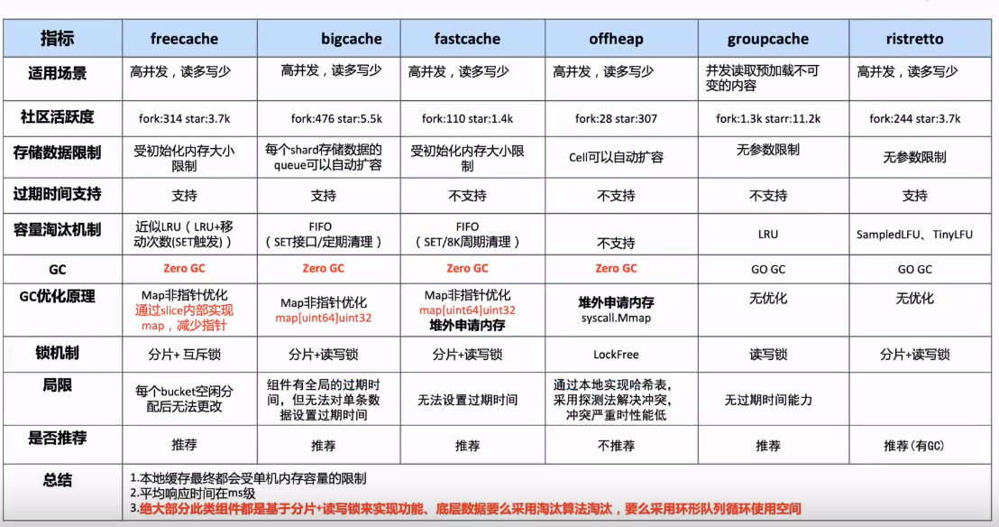

# Cache的需求

- 需要较高读写性能+命中率
- 支持按写入时间过期
- 支持淘汰策略
- 需要解决gc，大量stw扫描，cpu




## FastCache

特点:

- 线程安全(多个桶，降低并发冲突)
- 存储大量的cache实体，而且不会被GC扫描（堆内存unix.Mmap）
  - 内存映射的方式可以直接向操作系统申请内存，这块区域不归GC管。所以不管你在这块内存缓存了多少数据，都不会因为GC扫描而影响性能。
  - 但是这里分配的内存再也不会被释放，直到进程重启

- cache空间满了以后，fastcache会自动淘汰老数据块（RingBuf）
- 内存不会预先分配，随用随分配


fastcache为什么快，因为用了这些手段：

1. 使用mmap来成块的分配内存。
   - 每次直接向操作系统要64MB，这些内存都绕开了GC。
   - 每次以64KB为单位请求一个块
   - 在64KB的块内顺序存储，相当于更简单的自己实现的分配算法
2. 整个cache分成512个bucket
   - 相当于有了512个map+512个读写锁，通过这样减少了竞争
   - map类型的key和value都是整形，容量小，且对GC友好
   - 淘汰用轮换的方法+固定次数的set后再清理，解决了（或者说绕开了）碎片的问题

优点

- 快速地。多核 CPU 上的性能可扩展。请参阅下面的基准测试结果。
- 线程安全。并发 goroutine 可以读取和写入单个缓存实例。
- fastcache 设计用于在没有GC 开销的情况下存储大量条目 。
- 当达到创建时设置的最大缓存大小时，Fastcache 会自动驱逐旧条目。
- 简单的 API。
- 简单的源代码。
- 缓存可以保存到文件 并从文件加载。


## BigCache

为什么要设计出bigcache（背景）？

bigcache的作者在开发项目时需要用到缓存，并有一些需求：

- cache要支持http协议访问数据。
- cache要支持 **10K** RPS (5k 写，5k 读)。
- cache对象至少保持10分钟。
- 响应时间（在没有花费在网络上的时间的情况下测量）低于。
  - 5ms – 平均值
  - 第 99.9 个百分位数为 10 毫秒
  - 第 99.999 个百分位数为 400 毫秒
- 其它.....

为了满足这些要求，缓存本身需要:

- 即使有百万的缓存对象也要非常快。
- 支持大并发访问。
- 在一定时间后剔除条目。

首先，为了满足百万的缓存对象也要非常快，需要选择一个合适的数据结构。map就是一个非常不错的的结构，可以通过O(1)的时间复杂度获取数据。示例如下：

```go

```

如上通过map存储数据，在数据量比较大并发比较高的时候会延长 GC 时间，增加访问缓存的延迟，增加内存分配次数。应为`string` 实际上底层数据结构是由两部分组成，其中包含指向字节数组的指针和数组的大小：

```go
type StringHeader struct {
    Data uintptr
    Len  int
}
```

由于 `StringHeader`中包含指针，所以每次 GC 的时候都会扫描每个指针，那么在这个巨大的 `map`中是包含了非常多的指针的，所以造成了巨大的资源消耗。

如何解决GC停顿导致的延迟：

1. 导致GC停顿的主要原因是map内保存的指针太多，导致扫描一遍需要很长时间，那可以从减少指针使用入手。（代表：Freecache）
1. 可以考虑让我们存储数据的结构直接不被扫描，那就不会有停顿了。因为垃圾回收器检查的是堆上的资源，如果不把数据放在堆上，不就解决这个问题了吗？（代表：offheap）但堆外内存很容易产生内存泄漏。
2. 可以利用Go 1.5中修复的一个issue([#9477](https://github.com/golang/go/issues/9477)), 这个issue描述了Go的开发者优化了垃圾回收时对于map的处理，如果map对象中的key和value不包含指针，那么GC 便会忽略这个 map

其次，数据都是共享的要支持并发访问就要加锁访问，当大并发访问时大量的锁冲突会降低访问效率。我们要做的是尽量避免冲突，降低并发冲突可以通过分片做到，当写入数据时可以通过hash函数和取余运算，将数据分配到不同的分片上，每个分片都有各自的读写锁，各个分片互不影响，这大大降低了并发冲突。


bigcache就是利用这些特性，首先bigcache内存结构包含一个分片数组。 每个分片有自己的存储结构(一个大循环[]bytes用来存储实际数据)，索引结构(map[uint64\]\[uint32]保存索引,key存储数据相关的hash值，value存储数据实际存储在[]bytes中的偏移量)和读写锁。


set流程


get流程


删除回调流程


缓存的实现离不开如下几种：

1. 原生 `map`
2. `sync.Map`
3. 基于以上二者封装的复合型 `map`

前两者的缺点也很明显：

1. 当 `map` 中存在大量 keys 时，GC 扫描 `map` 产生的停顿将不能忽略（针对 `map` 中存储指针或数据类型底层也是由指针实现这样的场景）
2. 加锁的粒度

提高缓存性能的手段也是明确的：

1. 减少 GC
2. `map` 中尽量避免存储指针
3. 分段（Shards）存储，减少 `lock`

具体实现：

1. 索引（index）与数据（data）分离存储的 `map` 结构
   - 这样 GC 就变成了 `map` 无指针结构 和 `[]byte` 结构的扫描问题
2. GoLang 1.5 版本的 [优化说明](https://github.com/golang/go/issues/9477): 如果 `map` 的 key 或 value 中都不含指针, GC 便会忽略这个 `map`

3. 分片解决并发竞争：bigCache 中使用了分片技术。创建 `N` 个 shard，每个 shard 包含一个带锁的 `cacheShard`，bigCache 将数据分散到不同的 `cacheShard` 进行存储。当从缓存中读写数据时，根据 `HashFunc(key)%N` 选择其中一个 `cacheShard` ，获取缓存锁 `cacheShard.lock`，这样可以大幅降低并发过程中的锁粒度。
4. [ ]byte+map\[uint64\]\[ uint64\]规避GC：从 bigCache 的 `cacheShard` 结构来看，使用了 `map[uint64]uint32` 结构，其中 key 和 value 均无指针结构，其中 value 会追加到一个全局的 `[]byte` 中，每一个 shard 中包含一个全局 `[]byte` 类型的结构 `queue.BytesQueue`。由于此字节切片除了自身对象不包含其他指针，所以 GC 对于整个 `cacheShard` 的标记时间是 `O(1)`
5. `string`, `slice`和`time.Time`都包含指针。


缺点：

1. 无持久化功能，只能用作单机缓存。
2. bigcache只能等待清理最老的元素的时候把这些"虫洞"删除掉。
3. 在添加一个元素失败后，会清理空间删除最老的元素。
4. 还会专门有一个定时的清理goroutine, 负责移除过期数据。
5. 缓存对象没有读取的时候刷新过期时间的功能，所以放入的缓存对象最终免不了过期的命运。
6. 所有的缓存对象的`lifewindow`都是一样的，比如30分钟、两小时。


参考：

https://pandaychen.github.io/2020/03/03/BIGCACHE-ANALYSIS/

https://colobu.com/2019/11/18/how-is-the-bigcache-is-fast/

https://blog.allegro.tech/2016/03/writing-fast-cache-service-in-go.html

http://liuqh.icu/2021/06/15/go/package/14-bigcache/

https://zhuanlan.zhihu.com/p/487455942


https://blog.csdn.net/xingwangc2014/article/details/86548130

https://zhuanlan.zhihu.com/p/404334020

https://www.jdon.com/52554

https://github.com/bg5sbk/go-labs


bigcache

https://mp.weixin.qq.com/s/URiURNrXHUYP1v2Q50i7Bg

https://medium.com/codex/our-go-cache-library-choices-406f2662d6b

https://blog.csdn.net/weixin_33519829/article/details/112098752


## FreeCache

特点：

- 能存储数亿条记录（entry） 。
- 零GC开销。
- 高并发线程安全访问。
- 纯Golang代码实现。
- 支持记录（entry）过期。
- 接近LRU的替换算法。
- 严格限制内存的使用。
- 提供一个测试用的服务器，支持一些基本 Redis 命令。
- 支持迭代器。

set操作为什么高效

- 采用二分查找，极大的减少查找entry索引的时间开销。slot切片上的entry索引是根据hash16值有序排列的，对于有序集合，可以采用二分查找算法进行搜索，假设缓存了n个key，那么查找entry索引的时间复杂度为log2(n * 2^-16) = log2(n) - 16。

- 对于key不存在的情况下（找不到entry索引）。
  如果Ringbuf容量充足，则直接将entry追加到环尾，时间复杂度为O(1)。
  如果RingBuf不充足，需要将一些key移除掉，情况会复杂点，后面会单独讲解这块逻辑，不过freecache通过一定的措施，保证了移除数据的时间复杂度为O(1)，所以对于RingBuf不充足时，entry追加操作的时间复杂度也O(1)。

- 对于已经存在的key（找到entry索引）。
  如果原来给entry的value预留的容量充足的话，则直接更新原来entry的头部和value，时间复杂度为O(1)。
  如果原来给entry的value预留的容量不足的话，freecache为了避免移动底层数组数据，不直接对原来的entry进行扩容，而是将原来的entry标记为删除（懒删除），然后在环形缓冲区RingBuf的环尾追加新的entry，时间复杂度为O(1)。


key过期

- 对于过期的数据，freecache会让它继续存储在RingBuf中，RingBuf从一开始初始化之后，就固定不变了，是否删掉数据，对RingBuf的实际占用空间不会产生影响。
- 当get到一个过期缓存时，freecache会删掉缓存的entry索引（但是不会将缓存从RingBuf中移除），然后对外报ErrNotFound错误。
- 当RingBuf的容量不足时，会从环头开始遍历，如果key已经过期，这时才会将它删除掉。
- 如果一个key已经过期时，在它被freecache删除之前，如果又重新set进来（过期不会主动删除entry索引，理论上有被重新set的可能），过期的entry容量充足的情况下，则会重新复用这个entry。
- freecache这种过期机制，一方面减少了维护过期数据的工作，另一方面，freecache底层存储是采用数组来实现，要求缓存数据必须连续，缓存过期的剔除会带来空间碎片，挪动数组来维持缓存数据的连续性不是一个很好的选择。

freecache的不足

- 需要一次性申请所有缓存空间。用于实现segment的RingBuf切片，从缓存被创建之后，其容量就是固定不变的，申请的内存也会一直被占用着，空间换时间，确实避免不了。
- freecache的entry置换算法不是完全LRU，而且在某些情况下，可能会把最近经常被访问的缓存置换出去。
  entry索引切片slotsData无法一次性申请足够的容量，当slotsData容量不足时，会进行空间容量x2的扩容，这种自动扩容机制，会带来一定的性能开销。
- 由于entry过期时，不会主动清理缓存数据，这些过期缓存的entry索引还会继续保存slot切片中，这种机制会加快entry索引切片提前进行扩容，而实际上除掉这些过期缓存的entry索引，entry索引切片的容量可能还是完全充足的。
- 为了保证LRU置换能够正常进行，freecache要求entry的大小不能超过缓存大小的1/1024，而且这个限制还不给动态修改，具体可以参考github上的issues。

使用freecache的注意事项

- 缓存的数据如果可以的话，大小尽量均匀一点，可以减少RingBuf容量不足时的置换工作开销。
- 缓存的数据不易过大，这样子才能缓存更多的key，提高缓存命中率。


参考：

https://blog.csdn.net/chizhenlian/article/details/108435024

https://www.cxybb.com/article/baidu_32452525/118199343

https://juejin.cn/post/7072121084136882183


1.上线字典表替代方案

2.资产管理开发完成

3.开发资产统计


