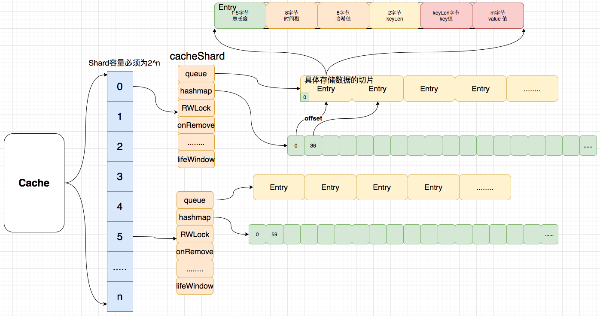
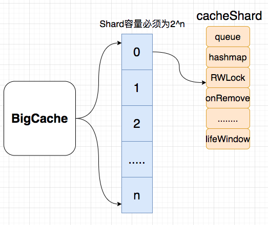
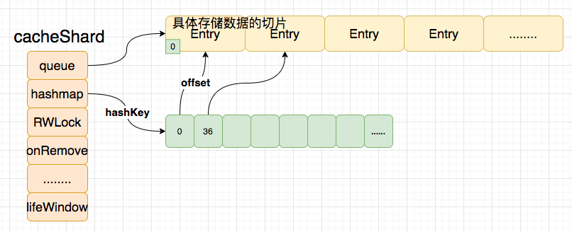
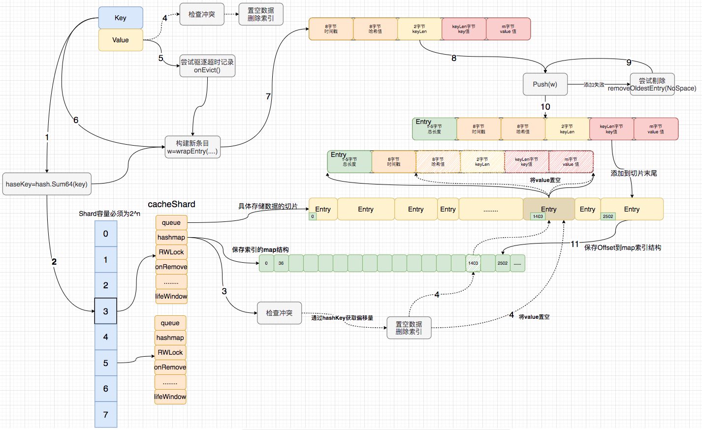
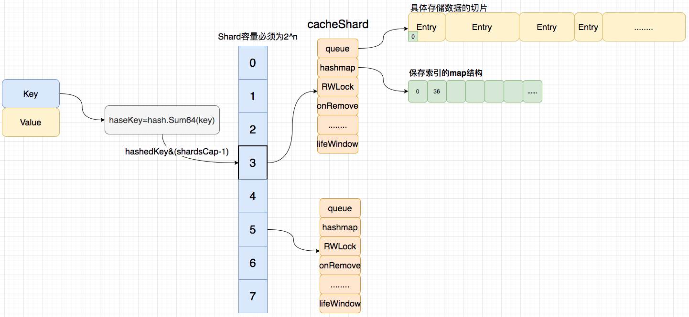
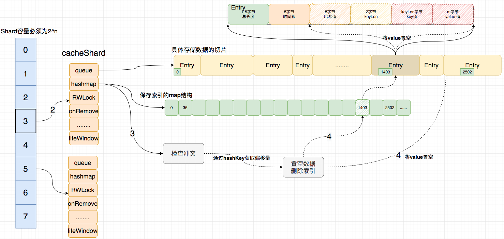
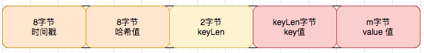
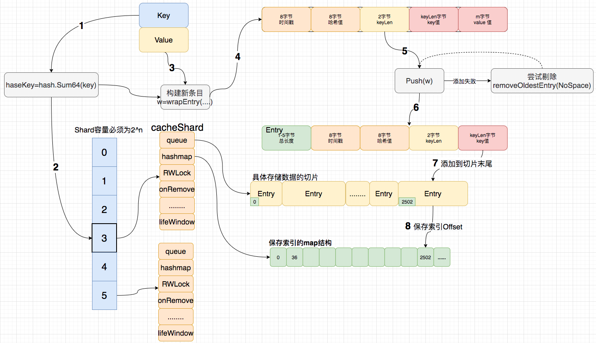
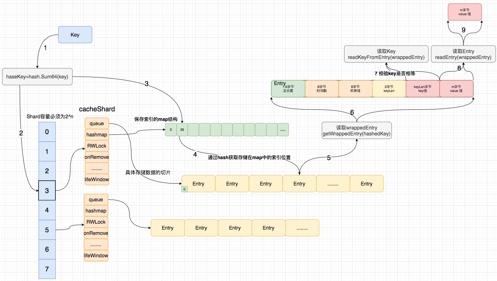

# BigCache

## 1.简介

今天我们来学习`bigcache`，`bigcache`是一个 `Golang` 的本地缓存库，同类型的缓存库还有`fastcache`，`freecache`等。

作为`bigcache`它有什么特性和优点呢？

1. 支持存储百万的缓存条目也非常快。
2. 支持大并发访问。
3. 支持在一定时间后剔除条目。
4. 几乎 `0 GC`。


## 2.应用

在详细阐述它是如何实现这些特性和优点前，我们先来看看`bigcache`的基础用法。

### 2-1.基础Set/Get

```go
package main

import (
	"fmt"
	"github.com/allegro/bigcache/v3"
	"time"
)

func main() {
  // 构造cache
  // 10 * time.Minute 所有条目的过期时间
	cache, _ := bigcache.NewBigCache(bigcache.DefaultConfig(10 * time.Minute))

	cache.Set("my-unique-key", []byte("value"))

	cache.Set("my-unique-key", []byte("value1")) // key 冲突覆盖value

	entry, _ := cache.Get("my-unique-key")
  fmt.Println(string(entry)) 
}
// out: value1
```

### 2-2.基础Append

```go
package main

import (
	"fmt"
	"github.com/allegro/bigcache/v3"
	"time"
)

func main() {
	cache, _ := bigcache.NewBigCache(bigcache.DefaultConfig(10 * time.Minute))

	cache.Set("my-unique-key", []byte("value1"))

	cache.Append("my-unique-key", []byte("value2"))

	cache.Append("my-unique-key", []byte("value3"))

	entry, _ := cache.Get("my-unique-key")
	fmt.Println(string(entry))
}
// out: value1value2value3
```

### 2-3.过期删除

```go
package main

import (
	"fmt"
	"github.com/allegro/bigcache/v3"
	"time"
)

func main() {
	cache, _ := bigcache.NewBigCache(bigcache.DefaultConfig(1 * time.Second))

	// when
	cache.Set("key", []byte("value"))
	<-time.After(3 * time.Second)
	value, err := cache.Get("key")
	if err != nil {
		fmt.Println(err.Error())
	} else {
		fmt.Println(string(value))
	}
}
// out: Entry not found
```

### 2-4.定时清理

```go
package main

import (
	"fmt"
	"github.com/allegro/bigcache/v3"
	"time"
)

func main() {
	cache, _ := bigcache.NewBigCache(bigcache.Config{
		Shards:             4,		// 分片数量
		CleanWindow:        time.Second,  // 定时清除间隔 1s
	})

	// when
	cache.Set("key", []byte("value"))
	<-time.After(3 * time.Second)
	value, err := cache.Get("key")
	if err != nil {
		fmt.Println(err.Error())
	} else {
		fmt.Println(string(value))
	}
}
// out: Entry not found
```

### 2-5.删除回调

```go
package main

import (
	"fmt"
	"github.com/allegro/bigcache/v3"
	"time"
)

func main() {
	onRemove := func(key string, entry []byte) {
		fmt.Printf("key:%s,vaule:%s removed\n", key, entry)
	}

	cache, _ := bigcache.NewBigCache(bigcache.Config{
		Shards:             4,
		CleanWindow:        time.Second,
		OnRemove:           onRemove,
	})

	// when
	cache.Set("key", []byte("value"))
	<-time.After(3 * time.Second)
	value, err := cache.Get("key")
	if err != nil {
		fmt.Println(err.Error())
	} else {
		fmt.Println(string(value))
	}
}
// out:
// key:key,vaule:value removed
// Entry not found
```

## 3.设计思想

介绍完bigcache的基础用法后，再来看看它是怎么设计的。

首先我们看一下它的存储结构：



整个`cache` 包含了一个分片指针数组，大小为`n`(容量必须是`2`的`n`次幂,这涉及到分片选择运算)，每个分片都是一个`cacheShard`，里面保存了存储数据的`entries([]byte)`循环队列和存储索引的`map`结构。

```go
type BigCache struct {
	shards     []*cacheShard // hash分片
	lifeWindow uint64        // 全局过期时间
	......
	hash       Hasher // hash函数
	......
	shardMask  uint64 // 最大分片数
	......
}

type cacheShard struct {
	hashmap     map[uint64]uint32 // 存储索引的哈希表 (0 GC)
	entries     queue.BytesQueue  // 存储数据的具体数据结构
	lock        sync.RWMutex
	entryBuffer []byte           // 复用切片，用于减少分配
	onRemove    onRemoveCallback // 删除回调

	......
	lifeWindow   uint64 // 条目驱除全局时间

	......
}
```



当数据写入`bigcache`时候，通过`Key`值计算一个哈希值`(hashedKey)`，然后通过`hashKey`去和他的分片数量取余找到对应的分片下标，然后获取对应的分片`(cacheShard)`

```go
func (c *BigCache) Set(key string) ([]byte, error) {
	hashedKey := c.hash.Sum64(key)
	shard := c.getShard(hashedKey)
	return shard.set(key, hashedKey)
}

func (c *BigCache) getShard(hashedKey uint64) (shard *cacheShard) {
    // shardMask 111111111111
    return c.shards[hashedKey&c.shardMask] // shardMask = len(shards)-1  
}
```

找到那个对应的分片后，再通过这个`hashkey`获取`hashmap`对应的偏移量，通过这个偏移量就可以获取`byte`数组对应的缓存条目。



### 3-1.详细Set流程



**第一步：获取分片**

```go
// Set saves entry under the key
func (c *BigCache) Set(key string, entry []byte) error {
	hashedKey := c.hash.Sum64(key)
	shard := c.getShard(hashedKey)
	return shard.set(key, hashedKey, entry)
}
```



1.首先创建一个`cache`实例，通过`Set`写入`key, value`：

```go
// given
cache, _ := NewBigCache(DefaultConfig(5 * time.Second))

// when
cache.Set("key", []byte("value"))
```

2.通过`hash`函数获取`key`的哈希值`hashedKey`：

```go
hashedKey := c.hash.Sum64(key)
```

3.通过`hashedKey`和分片个数 & 获取对应分片，由图可知我们找到`3`号分片。

```go
func (c *BigCache) getShard(hashedKey uint64) (shard *cacheShard) {
	return c.shards[hashedKey&c.shardMask]
}
```

**第二步：检查冲突**

```go
......
s.lock.Lock()

// 通过hashedKey获取s.hashmap的索引
if previousIndex := s.hashmap[hashedKey]; previousIndex != 0 { 
  // 通过索引获取对应条目
  if previousEntry, err := s.entries.Get(int(previousIndex)); err == nil {
    // 这个用到了slice的特性，切片持有源数据地址，修改切片会导致改源数组
    resetKeyFromEntry(previousEntry) 
    //remove hashkey
    delete(s.hashmap, hashedKey)
  }
}
......
```



获取到对应的分片后，首先通过`hashedKey`去获取分片内`hashmap`存储的索引（数据偏移量）；如果获取到索引不为`0`，表明当前`hashedKey`存在对应的值（存在`hash`冲突）；

```go
if previousIndex := s.hashmap[hashedKey]; previousIndex != 0 { 
  	........
}
```

当存在`hash`冲突，则通过索引获取循环队列里对应数据片段的引用并将该片段值置为空，并删除`hashmap`存储的索引；

```go
if previousIndex := s.hashmap[hashedKey]; previousIndex != 0 { 
  	// 通过索引获取对应条目
    if previousEntry, err := s.entries.Get(int(previousIndex)); err == nil {
      // 这个用到了slice的特性，切片持有源数据地址，修改切片会导致改源数组
      resetKeyFromEntry(previousEntry) 
      //remove hashkey
      delete(s.hashmap, hashedKey)
    }
}
```

**第三步：剔除过期数据**

检查`hash`冲突后，尝试剔除当前分片上最老的条目。首先从获取队尾数据（最老的条目），然后调用删除事件，并传入删除回调函数`removeOldestEntry`。

```go
if oldestEntry, err := s.entries.Peek(); err == nil { // 尝试驱逐过期条目，触发删除回调
  s.onEvict(oldestEntry, currentTimestamp, s.removeOldestEntry)
}
```

删除事件会通过当前时间和条目的存储时间求差值，然后和全局统一过期设置`(liftwindow)`做对比判断是否需要删除。

```go
// 驱逐
func (s *cacheShard) onEvict(oldestEntry []byte, currentTimestamp uint64, 
                             evict func(reason RemoveReason) error) bool {
	oldestTimestamp := readTimestampFromEntry(oldestEntry)// 获取条目的存储时间
	if currentTimestamp-oldestTimestamp > s.lifeWindow { // 判断过期窗框
		evict(Expired) // 删除事件[evict -> removeOldestEntry]
		return true
	}
	return false
}
```

确认过期，执行删除回调函数`removeOldestEntry`。

```go
// 删除最旧的条目，如果条目的hash被清空，则不执行删除回调
func (s *cacheShard) removeOldestEntry(reason RemoveReason) error {
	oldest, err := s.entries.Pop() // 获取并删除最近的条目
	if err == nil {
		hash := readHashFromEntry(oldest) // 获取条目的hashedKey值
		if hash == 0 {
			// entry has been explicitly deleted with resetKeyFromEntry, ignore
			return nil
		}
		delete(s.hashmap, hash) // 从hashmap中移除hashedKey对应的索引
		s.onRemove(oldest, reason) // 执行自定义回调函数
		if s.statsEnabled { // 统计
			delete(s.hashmapStats, hash)
		}
		return nil
	}
	return err
}
```

**第四步：包装Value生成条目**



尝试剔除一条旧条目后，开始包装条目，写入`buffer`(`buffer`是一个可复用的`[]byte`，可以减少内存分配)；

1. 写入当前时间`timestamp`占`8`位。
2. 写入`hashedKey`占`8`位
3. 写入`KeyLength`长度占`2`位
4. 写入`Key`值占`KeyLength`位
5. 写入`entry (Value)` 值占`m`位

```go
// |  8 bytes  |  8 bytes  |  2 bytes  | n byte | m bytes |
// | timestamp | hashValue | KeyLength |   Key  |  entry  |
func wrapEntry(timestamp uint64, hash uint64, key string, entry []byte,
               buffer *[]byte) []byte {
	keyLength := len(key)
	blobLength := len(entry) + headersSizeInBytes + keyLength

	if blobLength > len(*buffer) { // 复用buffer减少内存分配
		*buffer = make([]byte, blobLength)
	}
	blob := *buffer

	binary.LittleEndian.PutUint64(blob, timestamp) // 写入时间戳
	binary.LittleEndian.PutUint64(blob[timestampSizeInBytes:], hash) // 写入hash值
	binary.LittleEndian.PutUint16(blob[timestampSizeInBytes+hashSizeInBytes:], 
                                uint16(keyLength)) // 写入keyLength长度
	copy(blob[headersSizeInBytes:], key) // 写入key
	copy(blob[headersSizeInBytes+keyLength:], entry) // 写入value

	return blob[:blobLength]
}
```

**第五步：尝试写入**



```go
for { // 循环尝试添加条目到切片末尾，添加失败尝试驱逐
  if index, err := s.entries.Push(w); err == nil {
    s.hashmap[hashedKey] = uint32(index) // 记录索引
    s.lock.Unlock()
    return nil
  }
  if s.removeOldestEntry(NoSpace) != nil { // 尝试驱逐过期条目
    s.lock.Unlock()
    return fmt.Errorf("entry is bigger than max shard size")
  }
}
```

包装好条目后，将条目写入到分片的队列里；写入队列成功后再在`hashmap`上建立`hashedKey`对应的索引(`offset`)并返回；写入失败，则尝试剔除旧数据，循环如上步骤。

### 3-2.详细Get流程



**第一步：获取分片同上**

```go
func (c *BigCache) Get(key string) ([]byte, error) {
	hashedKey := c.hash.Sum64(key)
	shard := c.getShard(hashedKey)
	return shard.get(key, hashedKey)
}
```

**第二步：获取条目**

```go
func (s *cacheShard) get(key string, hashedKey uint64) ([]byte, error) {
	s.lock.RLock()                                    // 加锁
	wrappedEntry, err := s.getWrappedEntry(hashedKey) // 获取包裹的条目
	if err != nil {
		s.lock.RUnlock()
		return nil, err
	}
	if entryKey := readKeyFromEntry(wrappedEntry); key != entryKey { // 读取key
		s.lock.RUnlock()
		s.collision()
		if s.isVerbose {
			s.logger.Printf("Collision detected. Both %q and %q have the same hash %x", 
                            key, entryKey, hashedKey)
		}
		return nil, ErrEntryNotFound
	}
	entry := readEntry(wrappedEntry)
	s.lock.RUnlock()
	s.hit(hashedKey)

	return entry, nil
}
```

通过`hashedKey`获取报告条目。

```go
func (s *cacheShard) getWrappedEntry(hashedKey uint64) ([]byte, error) {
	itemIndex := s.hashmap[hashedKey]

	if itemIndex == 0 {
		s.miss()
		return nil, ErrEntryNotFound
	}

	wrappedEntry, err := s.entries.Get(int(itemIndex))
	if err != nil {
		s.miss()
		return nil, err
	}

	return wrappedEntry, err
}
```

在通过包裹条目`wrappendEntry`获取`entryKey`对比`key`是否相等。在通过包裹条目`wrappendEntry`获取`entry`并返回

### 3-3.核心问题

了解`Set/Get`流程后，再来看看`bigcache`解决的几个核心问题。

- 为什么要分片（降低并发冲突）
- 为什么要用`map`存储索引位置（减少`GC`时间）
- 为什么要用`[]byte`存储数据（适配`map`存储偏移量）


#### 3-3-1.map[uint64]uint32 (绕过GC)

缓存的实现离不开以下几种：

1. 原生 `map`+锁
2. `sync.Map`
3. 基于以上二者封装的复合型 `map`

前两者很明显的缺点：

1. 当 `map` 中存在大量带有指针的keys 时，`GC` 扫描 `map` 产生的停顿将不能忽略（针对 `map` 中存储带有指针类型的场景，列1）
2. 加锁的粒度不好控制

```go
// 列1
package main

import (
	"fmt"
	"runtime"
	"strconv"
	"time"
)

const N = 30e6

func mapInt32PointerTest()  {
	// Big map with a pointer in the value
	m := make(map[int32]*int32)
	for i := 0; i < N; i++ {
		n := int32(i)
		m[n] = &n
	}
	runtime.GC()
	fmt.Printf("With %T, GC took %s\n", m, timeGC())
	_ = m[0] // Preserve m until here, hopefully
}

func mapNInt32PointerTest()  {
	// Big map (preallocated) with a pointer in the value
	m := make(map[int32]*int32, N)
	for i := 0; i < N; i++ {
		n := int32(i)
		m[n] = &n
	}
	runtime.GC()
	fmt.Printf("With %T, GC took %s\n", m, timeGC())
	_ = m[0] // Preserve m until here, hopefully
}

func mapInt32Test()  {
	// Big map, no pointer in the value
	m := make(map[int32]int32)
	for i := 0; i < N; i++ {
		n := int32(i)
		m[n] = n
	}
	runtime.GC()
	fmt.Printf("With %T, GC took %s\n", m, timeGC())
	_ = m[0]
}

func mapNInt32Test()  {
	// Big map, no pointer in the value, map fully pre-allocated
	m := make(map[int32]int32, N)
	for i := 0; i < N; i++ {
		m[int32(i)] = int32(i)
	}
	runtime.GC()
	fmt.Printf("With %T, GC took %s\n", m, timeGC())
	_ = m[0]
}

func mapStringTest()  {
	// Big map with a pointer in the key
	m := make(map[string]string)
	for i := 0; i < N; i++ {
		m[strconv.Itoa(i)] = strconv.Itoa(i)
	}
	runtime.GC()
	fmt.Printf("With %T, GC took %s\n", m, timeGC())
	_ = m["0"]
}

func mapNStringTest()  {
	// Big map with a pointer in the key, map fully pre-allocated
	m := make(map[string]string, N)
	for i := 0; i < N; i++ {
		m[strconv.Itoa(i)] = strconv.Itoa(i)
	}
	runtime.GC()
	fmt.Printf("With %T, GC took %s\n", m, timeGC())
	_ = m["0"]
}

func structInt32Test()  {
	type t struct {
		p, q int32
	}
	var s []t
	for i := 0; i < N; i++ {
		n := int32(i)
		s = append(s, t{n, n})
	}
	runtime.GC()
	fmt.Printf("With a plain slice (%T), GC took %s\n", s, timeGC())
	_ = s[0]
}

func structNInt32Test()  {
	type t struct {
		p, q int32
	}
	s := make([]t, 0, N)
	for i := 0; i < N; i++ {
		s = append(s, t{int32(i), int32(i)})
	}
	runtime.GC()
	fmt.Printf("With a plain slice (%T), GC took %s\n", s, timeGC())
	_ = s[0]
}

func sliceStringTest(){
	var s []string
	for i := 0; i < N; i++ {
		s = append(s, strconv.Itoa(i))
	}
	runtime.GC()
	fmt.Printf("With a plain slice (%T), GC took %s\n", s, timeGC())
	_ = s[0]
}

func sliceNStringTest(){
	s := make([]string, N)
	for i := 0; i < N; i++ {
		s[i] = strconv.Itoa(i)
	}
	runtime.GC()
	fmt.Printf("With a plain slice (%T), GC took %s\n", s, timeGC())
	_ = s[0]
}

func main() {
	mapInt32PointerTest()
	mapNInt32PointerTest()
	mapInt32Test()
	mapNInt32Test()
	mapStringTest()
	mapNStringTest()
	structInt32Test()
	structNInt32Test()
	sliceStringTest()
	sliceNStringTest()
}

func timeGC() time.Duration {
	start := time.Now()
	runtime.GC()
	return time.Since(start)
}
```

```bash
# 结果
With map[int32]*int32, GC took 1.361993678s
With map[int32]*int32, GC took 1.833904147s
With map[int32]int32, GC took 56.67087ms
With map[int32]int32, GC took 1.212581ms
With map[string]string, GC took 5.899666241s
With map[string]string, GC took 3.243479909s
With a plain slice ([]main.t), GC took 411.346µs
With a plain slice ([]main.t), GC took 318.365µs
With a plain slice ([]string), GC took 312.079401ms
With a plain slice ([]string), GC took 306.468481ms
```

如上通过`map`存储数据，在数据量比较大的时候会增加 `GC` 时间，导致访问缓存延迟。

用`[]string`为例：因为`string` 底层数据结构是由两部分组成，其中包含指向字节数组的指针和数组的大小：

```go
type StringHeader struct {
    Data uintptr
    Len  int
}
```

由于 `StringHeader`中包含指针，所以每次 `GC` 的时候都会扫描每个指针，那么在这个巨大的 `Slice`中是包含了非常多的指针的，在扫描时就会消耗许多时间。

```go
s := []string{"abcd","abc","adca"}
for i,_ := range s{
  fmt.Printf("%p\n",&s[i])
  fmt.Printf("%p\n",unsafe.Pointer(uintptr(unsafe.Pointer(&s[i]))+uintptr(8)))
  fmt.Println(*(*int)(unsafe.Pointer(uintptr(unsafe.Pointer(&s[i]))+uintptr(8))))
}
```


如何解决大量指针被扫描导致`GC`停顿：

1. 导致`GC`停顿的主要原因是`map`内保存的指针太多，导致扫描一遍需要很长时间，那可以从减少指针使用入手。（代表：`Freecache`）
1. 可以考虑让我们存储数据的结构直接不被扫描，那就不会有停顿了。因此可以自己申请内存 ，`GC` 是不会来管理我们自己申请的内存的，但这些内存很容易产生内存泄漏（代表：`fastcache`）。
2. 可以利用`Go 1.5`中修复的一个issue([#9477](https://github.com/golang/go/issues/9477)), 这个`issue`描述了Go的开发者优化了垃圾回收时对于`map`的处理，如果`map`对象中的`key`和`value`不包含指针，那么`GC` 便会忽略这个 `map`（代表：`bigcache`）

`bigcache`通过`[ ]bytes+map[uint64]uint32`绕过了`GC`扫描，所以即使存储百万的缓存条目也非常快。

```go
type cacheShard struct {
	hashmap     map[uint64]uint32 // 存储索引的哈希表 (0 GC)
	entries     queue.BytesQueue  // 存储数据的具体数据结构
	lock        sync.RWMutex
	......
}

type BytesQueue struct {
	full         bool   // 是否已满
	array        []byte // 实际存储字节切片
	capacity     int    // array 容量
	head         int    // head索引位置
	tail         int    // tail索引位置
	count        int    // 存储条数
	.....
}
```

####  3-3-2.分片降低并发冲突

通过`[ ]bytes+map[uint64]uint32`绕过了`GC`扫描后，还有一个降低访问效率的因素，那就是并发冲突问题，因为数据都是共享的要支持并发访问就要加锁，当有大量并发访问时，锁冲突会降低访问效率。

针对该情况，我们要尽量避免冲突，降低并发冲突的一般方法就是数据分片。当写入数据时可以通过hash函数和取余运算，将数据分配到不同的分片上，每个分片都有各自的读写锁，各个分片互不影响，这样大大降低了并发冲突。[测试代码](https://github.com/Zhouchaowen/Labs/blob/master/lab_gc/ch_4/map_test.go)

测试结果

```bash
goos: darwin
goarch: amd64
pkg: Labs/lab_gc/ch_4
cpu: Intel(R) Core(TM) i5-5250U CPU @ 1.60GHz
BenchmarkShardMap-4            1        15255329056 ns/op       1915338624 B/op 50207696 allocs/op
BenchmarkMutexMap-4            1        20045658733 ns/op       1924801984 B/op 50312244 allocs/op
BenchmarkSyncMap-4             1        41354979469 ns/op       2369064560 B/op 100192507 allocs/op
```


## 4.总结

### 4-1.优点

1. 他支持存储百万的缓存条目也非常快。
2. 支持大并发访问。
3. 支持在一定时间后剔除条目。
4. 几乎 `0 GC`。


### 4-2.缺点

1. 无持久化功能，只能用作单机缓存,掉电缓存就消失了。
2. 虫洞，只能等待清理最老的元素的时候才能把这些"虫洞"删除掉。
3. 在添加一个元素失败后，会清理空间，删除最老的元素。
4. 还会专门有一个定时的清理`goroutine`, 负责标注过期数据。
5. 缓存条目没有读取的时候刷新过期时间的功能，所以放入的缓存条目最终都是会过期。
6. 所有的缓存条目的过期周期都是一样的。


参考：

https://pandaychen.github.io/2020/03/03/BIGCACHE-ANALYSIS/

https://colobu.com/2019/11/18/how-is-the-bigcache-is-fast/

https://blog.allegro.tech/2016/03/writing-fast-cache-service-in-go.html

http://liuqh.icu/2021/06/15/go/package/14-bigcache/

https://zhuanlan.zhihu.com/p/487455942

https://blog.csdn.net/xingwangc2014/article/details/86548130

https://zhuanlan.zhihu.com/p/404334020

https://www.jdon.com/52554

https://github.com/bg5sbk/go-labs

https://mp.weixin.qq.com/s/URiURNrXHUYP1v2Q50i7Bg

https://medium.com/codex/our-go-cache-library-choices-406f2662d6b

https://blog.csdn.net/weixin_33519829/article/details/112098752

http://sarailqaq.org.cn/2020/12/06/%E8%BF%9B%E7%A8%8B%E5%86%85%E7%BC%93%E5%AD%98bigcache/

https://go.cyub.vip/concurrency/sync-rwmutex.html


